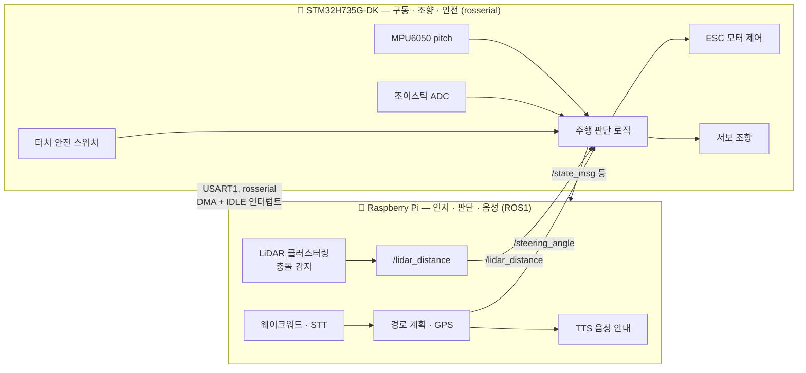
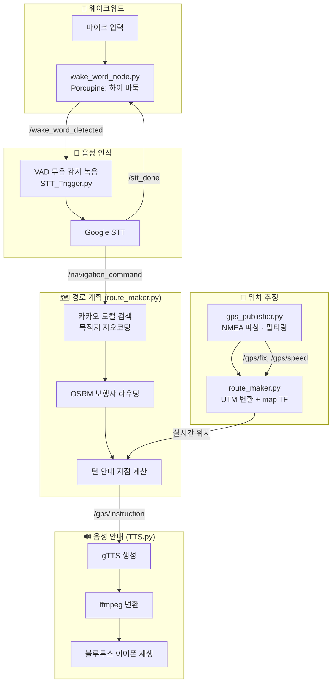

<div align="center">

# 🐾 BADUK — 시각장애인 안내로봇

**"당신의 목소리를 길로 바꾸는 따뜻한 동반자"**

Raspberry Pi(인지·경로계획·음성)와 STM32(모터 구동·조향·안전정지)가 rosserial로 연결되어 동작하는, 시각장애인의 안전하고 자율적인 보행을 지원하는 안내로봇입니다. "하이 바둑"이라고 부르면 깨어나 목적지를 듣고, 길을 계산해 음성으로 안내하며, 목줄(리시)과 조이스틱으로 자연스럽게 유도합니다.

[](http://wiki.ros.org/)
[](https://www.python.org/)
[](https://www.st.com/)
[](https://www.raspberrypi.com/)
[](https://picovoice.ai/platform/porcupine/)
[](https://developers.kakao.com/)

</div>

---

## 📋 목차

- [개요](#-개요)
- [팀 구성](#-팀-구성)
- [전체 아키텍처](#-전체-아키텍처-raspberry-pi--stm32)
- [기술 스택](#-기술-스택)
- [Raspberry Pi 파트 — 인지·경로·음성](#-raspberry-pi-파트--인지경로음성)
- [STM32 파트 — 구동·조향·안전](#-stm32-파트--구동조향안전)
- [폴더 구조](#-폴더-구조)
- [환경 변수](#-환경-변수)
- [이번에 고친 것들](#-이번에-고친-것들)
- [참고](#-참고)

---

## 📖 개요

현행 보행 환경은 점자블록·음향신호기 등으로 일부 개선되었지만, 시각장애인은 여전히 **정적/동적 장애물 회피, 신호등 인식, 정확한 목적지 안내**에 어려움을 겪습니다. BADUK(바둑이)은 이 문제를 해결하기 위한 안내로봇 시스템으로, 다음을 목표로 개발되었습니다.

- 🎙️ 음성 기반 경로 요청 인터페이스 — 목적지를 말하면 경로 안내 시작
- 🛑 실시간 장애물 감지 및 정지 — LiDAR로 장애물 탐지 후 회피 또는 정지
- 🔊 목적지 도착 시 음성 피드백
- 🌤️ 야외 보행환경 대응 — GPS/IMU 기반 위치 추정과 경로 재탐색

이름의 유래는 **B**rake, **A**void, **D**rive, **U**pdate, **K**eeppace — 장애물 앞에서 멈추고(Brake), 피하고(Avoid), 목줄과 IMU로 자연스럽게 끌어주듯 주행하고(Drive/Keeppace), 경로를 실시간으로 갱신(Update)한다는 개발 철학을 담고 있습니다.

## 👥 팀 구성

| 담당 | 역할 |
|---|---|
| 하드웨어 · STM32 · 통신 | 자율 안내로봇 하드웨어 플랫폼 설계/제작, LiDAR·IMU·터치센서 멀티센서 통합, **STM32 기반 저수준 실시간 제어** 및 rosserial 포팅, ROS 센서 드라이버 |
| 인지 · 경로 · 음성 SW | 딥러닝 기반 신호등 인식(YOLO), 목적지 경로 생성 및 음성 안내 인터페이스, 웨이크워드/STT/TTS 통합 |

## 🧭 전체 아키텍처 (Raspberry Pi ↔ STM32)

고수준 인지·판단은 Raspberry Pi(ROS)가, 저수준 모터 제어·안전 신호는 STM32가 전담하는 **이기종 시스템 역할 분리 구조**입니다. STM32는 ROS를 공식 지원하지 않지만, STM32H7 계열에 `rosserial`을 직접 포팅해 하나의 ROS 노드처럼 양방향 통신하도록 구현했습니다.



> Raspberry Pi 쪽 ROS 코드는 저장소 루트의 `src/`, STM32 쪽 저수준 제어 펌웨어는 [`stm32/`](stm32/)에 있습니다.

---

## 🛠 기술 스택

| 영역 | 사용 기술 |
|---|---|
| 미들웨어 | ROS1 (catkin, `rospy`) + STM32 `rosserial` 포팅 |
| 임베디드 | STM32H735G-DK (Cortex-M7), HAL, DMA, TIM PWM, I2C, ADC |
| 위치 추정 | u-blox NEO-M8N GPS 모듈 (NMEA/시리얼), `pyproj` UTM 변환, `tf2_ros` |
| 웨이크워드 | Picovoice **Porcupine** (한국어 커스텀 키워드 "하이 바둑") |
| 음성 인식 | `webrtcvad`(무음 감지) + Google Speech Recognition (`speech_recognition`) |
| 목적지 검색 | **카카오 로컬 API** (키워드 → 좌표) |
| 경로 계산 | **OSRM** 보행자 라우팅 |
| 음성 안내 | `gTTS` → `ffmpeg` → PulseAudio(`paplay`, 블루투스 이어폰) |
| 장애물 감지 | 2D LiDAR + DBSCAN 클러스터링, 최소 거리 기반 정지 판단 |
| 시각화 | RViz `Marker`/`MarkerArray` (GPS 경로·현재 위치) |

---

## 🍓 Raspberry Pi 파트 — 인지·경로·음성



<details>
<summary>토픽 상세</summary>

| 토픽 | 발행 | 구독 |
|---|---|---|
| `/gps/fix`, `/gps/speed`, `/gps/course` | `gps_publisher.py` | `route_maker.py` |
| `/gps/pose`, `/gps/route`, `/gps/instruction`, `/gps/next_waypoint_distance` | `route_maker.py` | `TTS.py` |
| `/wake_word_detected` | `wake_word_node.py` | `STT_Trigger.py` |
| `/stt_done` | `STT_Trigger.py` | `wake_word_node.py` (마이크 재개 신호) |
| `/recognized_text` | `STT_Trigger.py` | (디버그/로그용) |
| `/navigation_command` | `STT_Trigger.py` | `route_maker.py` (목적지 문자열 또는 `stop`) |

</details>

<details open>
<summary><b>1. GPS 파싱 및 필터링 (gps_publisher.py)</b></summary>

- NEO-M8N에서 들어오는 GNRMC(위치·속도·방위각)와 GPGGA(위성 수·HDOP) NMEA 문장을 직접 파싱
- 위성 수(`min_satellites`)·HDOP(`min_hdop`) 기준으로 저품질 신호를 걸러내고, 이전 위치와의 급격한 점프를 **이상치**로 판단해 제외
- 이동평균/중앙값 필터로 위경도·속도·방위각을 스무딩하고, HDOP 기반으로 `position_covariance`를 계산해 `NavSatFix`로 발행
- RViz용 `Marker`/`MarkerArray`로 이동 경로와 현재 위치(속도에 따라 색·크기 변화)를 시각화

</details>

<details open>
<summary><b>2. 웨이크워드 감지 (wake_word_node.py)</b></summary>

- Porcupine 엔진에 한국어 커스텀 키워드 모델("하이 바둑")을 로드해 48kHz 마이크 입력을 16kHz로 리샘플링 후 프레임 단위로 감지
- 감지되면 마이크 스트림을 닫고 `/wake_word_detected`를 발행, STT가 끝나 `/stt_done`을 받으면 스트림을 다시 열어 재개 (같은 마이크 장치를 STT와 번갈아 사용하기 위한 상호배제 처리)

</details>

<details open>
<summary><b>3. 음성 인식 (STT_Trigger.py)</b></summary>

- `webrtcvad`로 사람 목소리 구간을 판별해, 말이 시작된 뒤 일정 프레임 이상 무음이 지속되면 자동으로 녹음을 종료 (VAD 기반 엔드포인팅)
- 녹음된 WAV를 Google Speech Recognition(`ko-KR`)으로 텍스트 변환 후 `/navigation_command`로 발행

</details>

<details open>
<summary><b>4. 경로 계획 & 재탐색 (route_maker.py)</b></summary>

- 카카오 로컬 API로 목적지 키워드를 좌표로 변환하고, 현재/목적지 위치를 OSRM `/nearest`로 가장 가까운 보행 도로에 스냅한 뒤 `/route`로 전체 경로와 회전 안내(steps)를 요청
- GPS 정확도(HDOP 기반)에 따라 **경로 이탈 임계값·검색 윈도우·보간 해상도를 동적으로 조정** — 신호가 안 좋을수록 더 관대하게 판단
- 현재 위치가 경로에서 임계값 이상 벗어난 상태가 `MAX_OFF_ROUTE_COUNT`번 연속되면 백그라운드 스레드로 **자동 재탐색**
- 회전 지점 근처(10m 이내)에 도달하면 "잠시 후 좌회전입니다" 같은 안내를 1회만 발송, 100m 단위로 남은 거리 안내, 20m 이내에서 도착 안내

</details>

<details open>
<summary><b>5. 음성 안내 재생 (TTS.py)</b></summary>

- `/gps/instruction`으로 들어오는 문장을 `gTTS`로 mp3 생성 → `ffmpeg`로 wav 변환 → PulseAudio로 블루투스 이어폰에 재생
- 재생 중 새 안내가 들어와도 유실되지 않도록 재생 완료 시점에 안내 내용이 바뀌었는지 확인 후 다음 루프에서 이어서 재생

</details>

---

## 🔩 STM32 파트 — 구동·조향·안전

시각장애인이 실제로 손으로 잡는 **목줄(리시)과 조이스틱**을 통해 로봇을 따라 걷는 느낌을 만드는 저수준 제어부입니다. 상세 스펙과 코드는 [`stm32/`](stm32/) 참고 — 아래는 요약입니다.

- **STM32H735G-DK 기반 저전력·고정밀 실시간 제어**: 보행 보조의 핵심 제어 로직을 MCU에 최적화해 빠른 응답성과 낮은 전력 소모를 동시에 확보
- **STM32 ↔ ROS 비공식 연동 (rosserial 포팅)**: `STM32Hardware` 클래스로 rosserial의 Hardware 계층을 직접 대체, USART1을 DMA 수신 + IDLE 라인 인터럽트로 처리해 STM32가 하나의 ROS 노드처럼 동작
- **센서 직접 제어**: LiDAR 거리, IMU(MPU6050), 터치 센서, 조이스틱을 STM32가 직접 읽어 정지·회피·조향을 실시간 수행
- **안전 정지**: 터치 센서가 눌려있지 않으면(사용자가 손잡이를 놓으면) 즉시 `Motor_Stop()`
- **목줄 기반 속도 제어**: MPU6050 pitch 각도를 계산해 목줄이 아래를 향할수록(pitch > 35°) 더 빠르게 전진, 수평/위로 당기면 정지
- **DMA 기반 조이스틱 조향**: ADC2+DMA로 조이스틱을 읽어 CPU 부하 없이 안정적으로 서보(TIM1 PWM)를 제어 (10ms 응답)

<details open>
<summary><b>주행 판단 로직 요약</b></summary>

```
터치 안전 스위치 OFF               → 항상 정지
current_state != 자동(2) and != 초기(-1) → 정지
장애물 없음 + 조이스틱 X 뒤로 젖힘   → 후진
장애물 없음 + 조이스틱 X 앞으로 젖힘 → 고정 속도(700) 전진
장애물 없음 + IMU pitch > 35°       → pitch 비례 속도로 전진
그 외                               → 정지
```

</details>

---

## 📁 폴더 구조

| 패키지/경로 | 파일 | 역할 |
|---|---|---|
| `src/gps` | `scripts/gps_publisher.py` | NEO-M8N NMEA 파싱, 필터링, RViz 시각화 |
| `src/route_maker` | `scripts/route_maker.py` | UTM 변환, 카카오 지오코딩, OSRM 라우팅, 턴 안내, 재탐색 |
| `src/wake_word` | `scripts/wake_word_node.py` | Porcupine 웨이크워드 감지 |
| `src/stt` | `scripts/STT_Trigger.py` | VAD 녹음 + Google STT |
| `src/tts` | `scripts/TTS.py` | gTTS 음성 안내 생성 및 재생 |
| `src/robot_launch` | `launch/main.launch` | Raspberry Pi 쪽 전체 노드 통합 실행 |
| `stm32/` | `Core/Src/*.c`, `*.cpp` | 모터 구동·조향·IMU·rosserial — [상세 README](stm32/README.md) |

---

## 🔑 환경 변수

민감한 값은 `.env`(git 제외)에서 로드합니다. `.env.example`을 참고해 `catkin_ws` 루트(또는 노드를 실행하는 디렉터리)에 `.env`를 만들어주세요.

| 변수 | 용도 |
|---|---|
| `KAKAO_REST_API_KEY` | 카카오 로컬 API(목적지 검색) |
| `PORCUPINE_ACCESS_KEY` | Picovoice Porcupine 웨이크워드 엔진 |
| `MIC_DEVICE_INDEX` | 마이크 장치 인덱스 (환경마다 다름, 기본 1) |
| `TTS_AUDIO_SINK` | 음성 출력용 PulseAudio 싱크 이름 (블루투스 기기마다 다름) |

`python-dotenv`, `rospkg`가 필요합니다 (`pip install python-dotenv`).

---

## 📝 참고

- OSRM은 공개 데모 서버(`router.project-osrm.org`)를 사용하므로 rate limit이나 가용성 이슈가 있을 수 있습니다. 실서비스라면 자체 OSRM 서버 구축을 권장합니다.
- `wake_word` 패키지에는 한국어 커스텀 키워드 모델(`porcupine_params_ko.pv`, `하이-바둑_ko_raspberry-pi_v3_0_0.ppn`)이 포함되어 있어야 합니다.
- Raspberry Pi 쪽 실행: `roslaunch robot_launch main.launch`
- STM32 쪽 빌드/플래시 방법은 [`stm32/README.md`](stm32/README.md) 참고 (본 저장소에는 CubeMX 보일러플레이트 없이 애플리케이션 로직만 포함)
