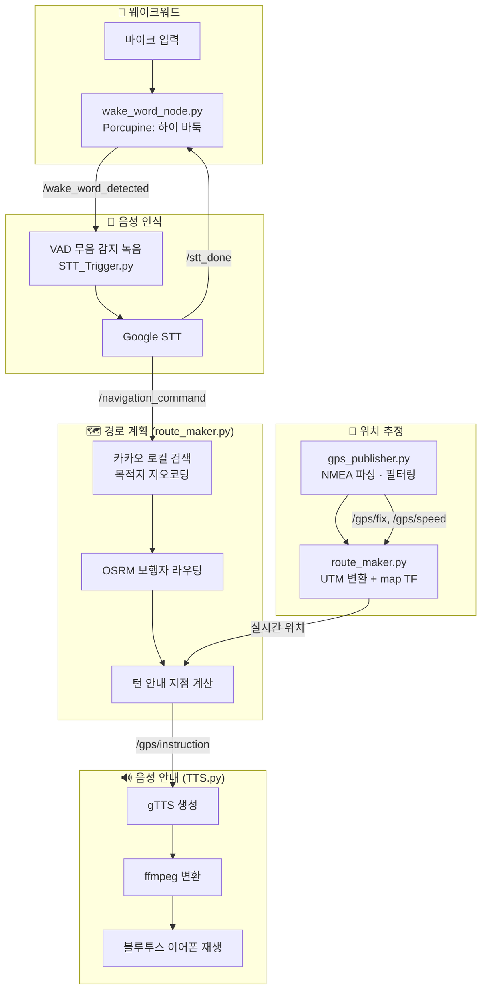

# 🐾 GuideBot — "하이 바둑"

**음성 웨이크워드로 깨워서, 목적지를 말하면 GPS 기반으로 길을 안내해주는 라즈베리파이 보행 안내 로봇**

"하이 바둑"이라고 부르면 깨어나 목적지를 듣고, 카카오맵으로 위치를 찾고, OSRM으로 보행 경로를 계산한 뒤, 턴마다 음성으로 안내합니다.

---

## 📋 목차

- [개요](#-개요)
- [기술 스택](#-기술-스택)
- [시스템 흐름](#-시스템-흐름)
- [핵심 로직](#-핵심-로직)
- [폴더 구조](#-폴더-구조)
- [환경 변수](#-환경-변수)
- [이번에 고친 것들](#-이번에-고친-것들)
- [참고](#-참고)

---

## 📖 개요

Raspberry Pi에 GPS 모듈, 마이크, 블루투스 이어폰을 연결해 만든 **음성 기반 보행 안내 로봇**입니다. "하이 바둑"이라는 웨이크워드로 로봇을 깨우면 마이크가 열리고, 사용자가 목적지를 말하면 음성을 텍스트로 바꿔 카카오 로컬 검색으로 좌표를 찾습니다. 이후 OSRM 보행자 라우팅으로 실제 걸을 수 있는 경로를 계산하고, GPS로 실시간 위치를 추적하면서 회전이 필요한 지점마다 "잠시 후 좌회전입니다" 같은 음성 안내를 재생합니다. 경로를 이탈하면 자동으로 재탐색하고, 목적지에 가까워지면 남은 거리를 주기적으로 안내합니다.

## 🛠 기술 스택

| 영역 | 사용 기술 |
|---|---|
| 미들웨어 | ROS1 (catkin, `rospy`) |
| 위치 추정 | u-blox NEO-M8N GPS 모듈 (NMEA/시리얼), `pyproj` UTM 변환, `tf2_ros` |
| 웨이크워드 | Picovoice **Porcupine** (한국어 커스텀 키워드 "하이 바둑") |
| 음성 인식 | `webrtcvad`(무음 감지) + Google Speech Recognition (`speech_recognition`) |
| 목적지 검색 | **카카오 로컬 API** (키워드 → 좌표) |
| 경로 계산 | **OSRM** 보행자 라우팅 (공개 데모 서버) |
| 음성 안내 | `gTTS` → `ffmpeg` → PulseAudio(`paplay`, 블루투스 이어폰) |
| 시각화 | RViz `Marker`/`MarkerArray` (GPS 경로·현재 위치) |

---

## 🔄 시스템 흐름

토픽 상세

| 토픽 | 발행 | 구독 |
|---|---|---|
| `/gps/fix`, `/gps/speed`, `/gps/course` | `gps_publisher.py` | `route_maker.py` |
| `/gps/pose`, `/gps/route`, `/gps/instruction`, `/gps/next_waypoint_distance` | `route_maker.py` | `TTS.py` |
| `/wake_word_detected` | `wake_word_node.py` | `STT_Trigger.py` |
| `/stt_done` | `STT_Trigger.py` | `wake_word_node.py` (마이크 재개 신호) |
| `/recognized_text` | `STT_Trigger.py` | (디버그/로그용) |
| `/navigation_command` | `STT_Trigger.py` | `route_maker.py` (목적지 문자열 또는 `stop`) |

---

## 🧠 핵심 로직

<b>1. GPS 파싱 및 필터링 (gps_publisher.py)</b>

- NEO-M8N에서 들어오는 GNRMC(위치·속도·방위각)와 GPGGA(위성 수·HDOP) NMEA 문장을 직접 파싱
- 위성 수(`min_satellites`)·HDOP(`min_hdop`) 기준으로 저품질 신호를 걸러내고, 이전 위치와의 급격한 점프를 **이상치**로 판단해 제외
- 이동평균/중앙값 필터로 위경도·속도·방위각을 스무딩하고, HDOP 기반으로 `position_covariance`를 계산해 `NavSatFix`로 발행
- RViz용 `Marker`/`MarkerArray`로 이동 경로와 현재 위치(속도에 따라 색·크기 변화)를 시각화

<b>2. 웨이크워드 감지 (wake_word_node.py)</b>

- Porcupine 엔진에 한국어 커스텀 키워드 모델("하이 바둑")을 로드해 48kHz 마이크 입력을 16kHz로 리샘플링 후 프레임 단위로 감지
- 감지되면 마이크 스트림을 닫고 `/wake_word_detected`를 발행, STT가 끝나 `/stt_done`을 받으면 스트림을 다시 열어 재개 (같은 마이크 장치를 STT와 번갈아 사용하기 위한 상호배제 처리)

<b>3. 음성 인식 (STT_Trigger.py)</b>

- `webrtcvad`로 사람 목소리 구간을 판별해, 말이 시작된 뒤 일정 프레임 이상 무음이 지속되면 자동으로 녹음을 종료 (VAD 기반 엔드포인팅)
- 녹음된 WAV를 Google Speech Recognition(`ko-KR`)으로 텍스트 변환 후 `/navigation_command`로 발행

<b>4. 경로 계획 & 재탐색 (route_maker.py)</b>

- 카카오 로컬 API로 목적지 키워드를 좌표로 변환하고, 현재/목적지 위치를 OSRM `/nearest`로 가장 가까운 보행 도로에 스냅한 뒤 `/route`로 전체 경로와 회전 안내(steps)를 요청
- GPS 정확도(HDOP 기반)에 따라 **경로 이탈 임계값·검색 윈도우·보간 해상도를 동적으로 조정** — 신호가 안 좋을수록 더 관대하게 판단
- 현재 위치가 경로에서 임계값 이상 벗어난 상태가 `MAX_OFF_ROUTE_COUNT`번 연속되면 백그라운드 스레드로 **자동 재탐색**
- 회전 지점 근처(10m 이내)에 도달하면 "잠시 후 좌회전입니다" 같은 안내를 1회만 발송, 100m 단위로 남은 거리 안내, 20m 이내에서 도착 안내

<b>5. 음성 안내 재생 (TTS.py)</b>

- `/gps/instruction`으로 들어오는 문장을 `gTTS`로 mp3 생성 → `ffmpeg`로 wav 변환 → PulseAudio로 블루투스 이어폰에 재생
- 재생 중 새 안내가 들어와도 유실되지 않도록 재생 완료 시점에 안내 내용이 바뀌었는지 확인 후 다음 루프에서 이어서 재생

---

## 📁 폴더 구조

| 패키지 | 파일 | 역할 |
|---|---|---|
| `gps` | `scripts/gps_publisher.py` | NEO-M8N NMEA 파싱, 필터링, RViz 시각화 |
| `route_maker` | `scripts/route_maker.py` | UTM 변환, 카카오 지오코딩, OSRM 라우팅, 턴 안내, 재탐색 |
| `wake_word` | `scripts/wake_word_node.py` | Porcupine 웨이크워드 감지 |
| `stt` | `scripts/STT_Trigger.py` | VAD 녹음 + Google STT |
| `tts` | `scripts/TTS.py` | gTTS 음성 안내 생성 및 재생 |
| `robot_launch` | `launch/main.launch` | 전체 노드 통합 실행 |

---

## 🔑 환경 변수

민감한 값은 `.env`(git 제외)에서 로드합니다. `.env.example`을 참고해 `catkin_ws` 루트(또는 노드를 실행하는 디렉터리)에 `.env`를 만들어주세요.

| 변수 | 용도 |
|---|---|
| `KAKAO_REST_API_KEY` | 카카오 로컬 API(목적지 검색) |
| `PORCUPINE_ACCESS_KEY` | Picovoice Porcupine 웨이크워드 엔진 |
| `MIC_DEVICE_INDEX` | 마이크 장치 인덱스 (환경마다 다름, 기본 1) |
| `TTS_AUDIO_SINK` | 음성 출력용 PulseAudio 싱크 이름 (블루투스 기기마다 다름) |

`python-dotenv`, `rospkg`가 필요합니다 (`pip install python-dotenv`).

---

## 🔧 이번에 고친 것들

- **보안**: 소스에 하드코딩되어 있던 카카오 REST API 키와 Porcupine Access Key를 `.env` 기반 환경변수로 이동 (⚠️ 이전에 노출됐던 두 키는 이미 공개 저장소 히스토리에 남아있으므로 별도로 재발급 필요)
- **`TTS.py`**: 안내 재생 중(수 초 소요) 새 안내가 들어오면 재생 완료 시 무조건 초기화되어 **안내가 소리 없이 유실되던 버그**를 수정 — 재생 시작 시점의 문구와 비교해 바뀐 경우에만 이어서 재생
- **`gps_publisher.py`**: `if self.ser.in_waiting`이 한 주기(100ms)에 한 줄만 처리해 다중 NMEA 문장이 밀리던 문제를 `while`로 변경해 버퍼를 매 주기 완전히 소진하도록 수정
- **`wake_word_node.py`**: STT 처리 중 `sleep` 없이 도는 busy-wait 루프를 짧은 `rospy.sleep()`으로 교체해 라즈베리파이에서 불필요한 CPU 점유를 제거. 하드코딩된 모델/키워드 파일 경로도 `rospkg`로 패키지 경로를 찾도록 변경
- **`route_maker.py`**: `route_coords`/`pending_instructions` 등 전역 상태를 GPS 콜백 스레드와 재탐색/거리안내 백그라운드 스레드가 락 없이 동시에 건드리던 부분에 `route_state_lock`을 추가하고, 경로 재계산 시 route_coords·턴 안내 목록을 한 번에 원자적으로 교체하도록 정리. `0.0`(적도) 좌표를 "GPS 없음"으로 오판하던 `not latest_lat` 체크도 `is None`으로 수정
- **저장소 정리**: 죽은 코드(`src/stt/STT_Trigger.py` 중복 파일), 빈 편집기 백업(`main.launch.save`), 편집기 스왑 파일(`.wake_word_node.py.swp`) 삭제 및 `.gitignore`에 관련 패턴 추가

---

## 📝 참고

- OSRM은 공개 데모 서버(`router.project-osrm.org`)를 사용하므로 rate limit이나 가용성 이슈가 있을 수 있습니다. 실서비스라면 자체 OSRM 서버 구축을 권장합니다.
- `wake_word` 패키지에는 한국어 커스텀 키워드 모델(`porcupine_params_ko.pv`, `하이-바둑_ko_raspberry-pi_v3_0_0.ppn`)이 포함되어 있어야 합니다.
- 실행: `roslaunch robot_launch main.launch`
